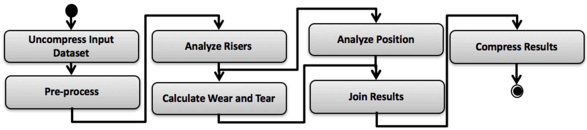

# Risers Fatigue Analysis Synthetic - Spark

## Risers Fatigue Analysis synthetic workflow
This is our case study. It is based on a real workflow used in the oil and gas domain. The RFA workflow is composed of seven activites that receive input tuples, perform complex calculations based on them, and transform tuples into resulting output tuples.



- Data Gathering - split one tuple into many tuples
- Preprocessing - map
- Stress Analysis - map
- Stress Critical Case Selection - filter
- Curvature Critical Case Selection - filter
- Calculate Fatigue Life - join
- Compress Results - reduce tuples

## How to Run
### Dependencies:
- [Apache Spark Cluster](https://spark.apache.org/docs/1.1.0/cluster-overview)
- [Python2](https://www.python.org/downloads/)
- [Bash](https://www.gnu.org/software/bash/)

### Setup and configuration:
Clone repository:
```sh
$ git clone https://github.com/hpcdb/RFA-Spark.git
$ cd RFA-Spark
```
#### Edit the input file:
```sh
$ vi input.dataset
```
- Example:
```csv
ID;SPLITMAP;SPLITFACTOR;MAP1;MAP2;FILTER1;F1;FILTER2;F2;REDUCE;REDUCEFACTOR
1;5;8;5;5;5;50;5;50;5;4
```
- **Fields**:
     - **ID**: Entry identifier
     - **SPLITMAP**: Average Task Cost in Uncompress activity (seconds)
     - **SPLITFACTOR**: Number of entries in the input dataset after uncompression
     - **MAP1**: Average Task Cost in Pre-Processing activity (seconds)
     - **MAP2**: Average Task Cost in Analyze Riser sactivity (seconds)
     - **FILTER1**:Average Task Cost in Calculate Wear and Tear activity (seconds)
     - **F1**: Amount of entries for Calculate Wear and Tear activity to filter in % (i.e., Percentage that will continue in the flow)
     - **FILTER2**:Average Task Cost in Analyze Position activity (seconds)
     - **F2**: Amount of entries for Analyze Position activity to filter in %(i.e., Percentage that will continue in the flow)
     - **REDUCE**: Average Task Cost in Compress Results activity (seconds)
     - **REDUCEFACTOR**:  Number of compressed output entries

### Run
- [Start Apache Spark Cluster](https://spark.apache.org/docs/1.1.0/cluster-overview.html)
- Set SPARK_HOME environment variable
```sh
$ export SPARK_HOME=/path/to/spark
```
- Change directory to RFA-Spark home:
```sh
$ cd RFA-Spark
```
- Run:
```sh
$ ./run.sh <spark-master-url> <num-executors> <total-executor-cores>
```
Where:
   - **spark-master-url**: The master URL for the cluster
   - **num-executors**: Number of Apache Spark executors requested on thec cluster.
   - **total-executor-cores**: Total Number of cores requested on the cluster.

- Example:
```sh
$ ./run.sh  spark://hostname:7077 1 2
```
## Source and Build:

[Source Code](rfa-spark-project)

### Build Dependencies
- [Maven 3](http://maven.apache.org)
- [Scala](http://www.scala-lang.org/)

### Build
- Change directory to rfa-spark-project:
```sh
$ cd RFA-Spark/rfa-spark-project
```
- Maven
```sh
$ mvn package
```
